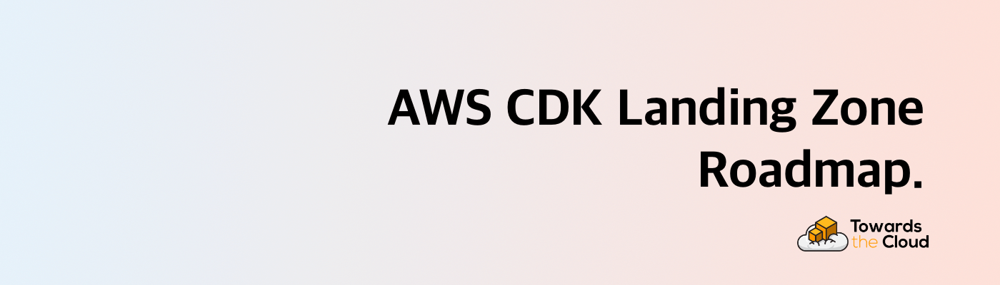

# 

# AWS CDK Landing Zone Roadmap

> This is the public roadmap for the custom build [AWS CDK Landing Zone solution](https://cdklandingzone.com) provided by [Towards the Cloud](https://towardsthecloud.com).

# Introduction

👋 If you came here from our landing page, you're in the right place! View our detailed roadmap here: [AWS CDK Landing Zone Roadmap](https://github.com/orgs/towardsthecloud/projects/1)

If you found this via GitHub or another source, then please visit our [landing page](https://towardsthecloud.com/aws-landing-zone) to find out more about our custom AWS Landing Zone solution or... read this section below ⤵︎

# What is the AWS CDK Landing Zone?

Launch faster on AWS and become fully compliant from day one! Our solution is designed for B2B startups and growing businesses that want to focus on building and deploying their products on AWS instead of managing multi-account complexity.

## The Hidden Cost of AWS Simplicity

While AWS makes it super easy to get started, that initial simplicity can lead to significant challenges:

- **Limited isolation and increased blast radius**: Without proper account separation, errors in one workload can affect all others
- **Scalability issues**: Single-account approaches don't scale well with organizational growth
- **Complex cost management**: Tracking costs becomes increasingly difficult as resources multiply
- **Security and compliance challenges**: Implementing distinct security policies becomes complex
- **IAM configuration complexity**: Managing access control requires intricate policies, increasing security risks

## Our Solution

The AWS CDK Landing Zone from Towards the Cloud delivers:

### 1. Full Compliance Out of the Box
- **100%** score on CIS AWS Foundation Benchmark
- **96%** rating on AWS foundational security best practices

### 2. Secure Guardrails
- Pre-configured security policies based on AWS's best practices
- Automatic blocking of risky actions
- Protection for both business and budget

### 3. Everything via Infrastructure as Code
- Written completely in AWS CDK Typescript
- Utilizes GitHub actions to quickly deploy on AWS

### 4. Batteries included
- Uses CloudFormation stacksets to automatically provision the AWS accounts in the organization
- Multi-region is supported for the stacksets
- Adds observability tools including notifications to keep you in control
- Bootstraps your AWS workload accounts so you can immediately start developing on it.

# Features

Our solution goes beyond basic AWS Control Tower or AWS OrgFormation implementations. It provides the right security, observability and bootstraps to make sure you’re ready to instantly onboard your applications and products.

To see how, here’s a list of the features that are **already included** in our Landing Zone:

| **Feature**                     | **Description**                                                                                                                                                                                                                                                                                  |
| ------------------------------- | ------------------------------------------------------------------------------------------------------------------------------------------------------------------------------------------------------------------------------------------------------------------------------------------------ |
| **Close Account**               | Automates the closure of AWS accounts when they are moved to a suspended organizational unit, reducing manual intervention and mistakes.                                                                                                                                                         |
| **Cost Anomaly Monitoring**     | Detects unusual cost patterns across AWS services and sends immediate SNS notifications to ensure cost overruns are quickly addressed.                                                                                                                                                           |
| **Configuration Recorder**      | Captures and delivers AWS Config snapshots, enabling continuous tracking of configuration changes and ensuring compliance across environments.                                                                                                                                                   |
| **CloudTrail Logging**          | Centralizes AWS CloudTrail logs and sets up CloudWatch alarms for key security events (such as unauthorized access and root-user activity) to enhance security monitoring.                                                                                                                       |
| **Budget Alerts**               | Sets up cost budgets with notifications for actual and forecasted spending that exceed defined thresholds, allowing proactive budget management.                                                                                                                                                 |
| **Enable EBS Encryption**       | Automatically enables encryption for all new EBS volumes in the account using a custom resource to enforce a secure-by-default storage policy.                                                                                                                                                   |
| **S3 Block Public Access**      | Applies account-level S3 public access block settings to prevent accidental public exposure of S3 buckets and data.                                                                                                                                                                              |
| **Increase Service Quota**      | Automates requests for AWS service quota increases via a custom resource, ensuring resources are available as demand grows.                                                                                                                                                                      |
| **Encrypted SNS Topic**         | Creates an SNS topic with encryption backed by a KMS key and tailored access policies to secure notification data and control subscriber access.                                                                                                                                                 |
| **Detect StackSet Drift**       | Regularly checks for drift in CloudFormation StackSets using a scheduled Lambda function, maintaining the desired configuration state across your account.                                                                                                                                       |
| **Delete Default VPC**          | Removes the default VPC in newly created regions using a custom resource and Lambda, helping maintain a clean and secure AWS environment by eliminating unused resources.                                                                                                                        |
| **Set Alternate Contact**       | Automatically configures alternate contacts (security, billing, operations) for new AWS accounts, ensuring that proper notifications and account management are in place.                                                                                                                        |
| **Unsubscribe Marketing Mails** | Automatically opts out new AWS accounts from receiving AWS marketing emails, helping maintain desired email preferences across the organization.                                                                                                                                                 |
| **Set Account Password Policy** | Enforces a robust IAM password policy with requirements like minimum length, expiration, reuse prevention, and complexity rules, thereby strengthening overall account security.                                                                                                                 |
| **CDK Bootstrap Stackset**      | Provisions the core bootstrap resources needed for CDK deployments. This includes an encrypted and versioned S3 bucket for file assets, an ECR repository for container images with automated image scanning and lifecycle rules, and preconfigured IAM roles.                                   |
| **Central Alerts Stackset**     | Establishes centralized, encrypted SNS topics for alerting. It sets up topics for CloudTrail and AWS Config notifications, applying organization-based access controls and allowing the security team to receive timely alerts via email.                                                        |
| **AWS Config Stackset**         | Deploys AWS Config recording with integration to existing log archive and security accounts. It imports an SNS topic for notifications as well as an S3 bucket for storing AWS Config logs, ensuring that configuration changes and compliance events are centrally recorded and alerted upon.   |
| **Secure Defaults**             | Applies security best practices by enforcing secure defaults. For global accounts, it blocks public S3 access and sets a strict account password policy; for regional deployments, it removes the default VPC, enables EBS encryption by default, and secures new VPCs' default security groups. |
| **Security Hub Management**     | Centralizes AWS Security Hub configuration across the organization by deploying aggregators, establishing organization-wide configuration policies for enabled and disabled standards, and associating these policies with the relevant organizational units.                                    |
| **Log Archive**                 | Sets up a centralized logging architecture for both CloudTrail and AWS Config. This stackset provisions secure S3 buckets with access logs, lifecycle rules, and proper bucket policies to ensure compliance and effective log retention across the organization.                                |
| **GuardDuty Deployment**        | Deploys Amazon GuardDuty with dual options: either enabling a delegated administrator account for centralized management or auto-configuring GuardDuty detectors along with organizational settings to automatically enable GuardDuty for all members.                                           |

# FAQ

**Q: Why did you create this?**
A: To provide transparency to clients about upcoming features and enable their participation in shaping the AWS CDK Landing Zone future. Clients with active subscriptions automatically receive new features as they're released.

**Q: Why are there no dates on your roadmap?**
A: Security and operational stability are our primary focus. We can't provide specific target dates as the roadmap is subject to change, and issues don't guarantee feature implementation as proposed.

**Q: What do the roadmap categories mean?**
- **Just shipped**: Recently released features
- **Coming soon**: Expected within a couple of months
- **We're working on it**: In progress but further out
- **Researching**: In the design and planning phase

**Q: How can I provide feedback or ask for more information?**
A: Visit our [landing page](https://towardsthecloud.com/aws-landing-zone) for more information about this product.

**Q: How can I request a feature be added to the roadmap?**
A: Existing customers can submit feature requests through our [GitHub issues](https://github.com/towardsthecloud/aws-cdk-landing-zone-roadmap/issues).
