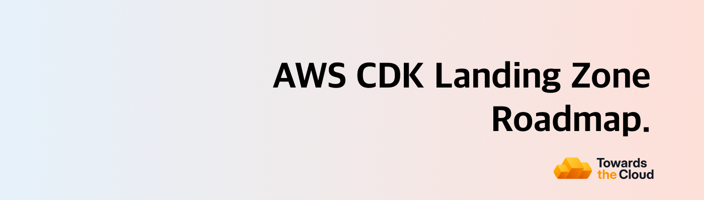

# 

# AWS CDK Landing Zone Roadmap

> This is the public roadmap for the AWS CDK Landing Zone product, built and deployed by [Towards the Cloud](https://github.com/towardsthecloud).

- Product overview: https://towardsthecloud.com/services/aws-landing-zone
- Buy via AWS Marketplace (Professional Services): https://aws.amazon.com/marketplace/pp/prodview-zejyre7rky6cq
- Roadmap project board: https://github.com/orgs/towardsthecloud/projects/1

# What is the AWS CDK Landing Zone?

A production-ready, multi-account AWS foundation (security, logging, guardrails, and account provisioning) delivered entirely as Infrastructure as Code using AWS CDK TypeScript. Built for B2B startups and growing teams who need to become audit-ready fast while maintaining full control over their infrastructure.

# Why Not AWS Control Tower?

AWS Control Tower is a common starting point, but teams quickly run into limitations:

| **Challenge**           | **AWS Control Tower**                                                        | **AWS CDK Landing Zone**                                              |
| ----------------------- | ---------------------------------------------------------------------------- | --------------------------------------------------------------------- |
| **Cost**                | High base cost—enables many services by default whether you need them or not | Pay only for what you use—enable services selectively                 |
| **Customization**       | Limited—you wait for AWS to support new features and configurations          | Full control—customize anything immediately using native AWS CDK      |
| **Management**          | ClickOps via AWS Console—manual, error-prone, hard to audit                  | GitOps-first—all changes through code, fully auditable and repeatable |
| **Drift & Consistency** | Manual drift detection, difficult to enforce desired state                   | Automated drift detection with Infrastructure as Code guarantees      |
| **Vendor Lock-in**      | Tied to AWS's implementation decisions and timeline                          | You own the code—extend, modify, or migrate as needed                 |

**Bottom line:** Control Tower trades flexibility for convenience. If you need a compliant AWS foundation that you actually control, the AWS CDK Landing Zone gives you enterprise-grade security without the rigidity or hidden costs.

# Key Benefits

### 1. Full Compliance Out of the Box
- Multi-account architecture with security controls and compliance guardrails from day one
- Achieve **100%** on CIS AWS Foundation Benchmark and **96%** on AWS Foundational Security Best Practices
- These benchmarks map directly to SOC 2, HIPAA, and PCI-DSS controls, cutting months from your compliance timeline

### 2. Secure Guardrails
- Pre-configured security policies based on AWS's best practices
- Automatic blocking of risky actions
- Protection for both business and budget

### 3. Everything via Infrastructure as Code
- Written completely in AWS CDK TypeScript
- GitOps-first deployments (for example via GitHub Actions)

### 4. Single Sign-On Integration
- Sets up AWS SSO (Identity Center) with external identity providers
- Supports integration with Entra ID, JumpCloud, or AWS Identity Provider
- Provides centralized identity management across all AWS accounts

### 5. Batteries included
- Uses CloudFormation StackSets to automatically provision the AWS accounts in the organization
- Multi-region is supported for the StackSets
- Adds observability tools including notifications to keep you in control
- Bootstraps your AWS workload accounts so you can immediately start developing on it.

## Delivery & Maintenance Options

This Landing Zone is deployed by Towards the Cloud as a productized implementation (also available via AWS Marketplace). After handover, you choose how it’s operated:

- **Self-managed**: Your team owns day-to-day operations and upgrades. We provide support for questions about the architecture, code, and operational guidance.
- **Managed service**: We maintain, update, and continuously improve the Landing Zone as new features ship.

Compare what’s included in each option and see pricing: https://towardsthecloud.com/pricing

# Features

Our solution goes beyond basic AWS Control Tower or AWS OrgFormation implementations. It provides the right security, observability and bootstraps to make sure you're ready to instantly onboard your applications and products.

To see how, here's a list of the features that are **already included** in our Landing Zone:

| **Feature**                          | **Description**                                                                                                                                                                                                                                                                                  |
| ------------------------------------ | ------------------------------------------------------------------------------------------------------------------------------------------------------------------------------------------------------------------------------------------------------------------------------------------------ |
| **SECURITY & COMPLIANCE**            |                                                                                                                                                                                                                                                                                                  |
| **Centralized Root User Management** | Enables centralized root user management and securely deletes all member account root users, reducing security risks and ensuring proper access control across the organization.                                                                                                                 |
| **Enable EBS Encryption**            | Automatically enables encryption for all new EBS volumes in the account using a custom resource to enforce a secure-by-default storage policy.                                                                                                                                                   |
| **S3 Block Public Access**           | Applies account-level S3 public access block settings to prevent accidental public exposure of S3 buckets and data.                                                                                                                                                                              |
| **Encrypted SNS Topic**              | Creates an SNS topic with encryption backed by a KMS key and tailored access policies to secure notification data and control subscriber access.                                                                                                                                                 |
| **Set Account Password Policy**      | Enforces a robust IAM password policy with requirements like minimum length, expiration, reuse prevention, and complexity rules, thereby strengthening overall account security.                                                                                                                 |
| **Secure Defaults**                  | Applies security best practices by enforcing secure defaults. For global accounts, it blocks public S3 access and sets a strict account password policy; for regional deployments, it removes the default VPC, enables EBS encryption by default, and secures new VPCs' default security groups. |
| **GuardDuty Deployment**             | Deploys Amazon GuardDuty with dual options: either enabling a delegated administrator account for centralized management or auto-configuring GuardDuty detectors along with organizational settings to automatically enable GuardDuty for all members.                                           |
| **CloudTrail Logging**               | Centralizes AWS CloudTrail logs and sets up CloudWatch alarms for key security events (such as unauthorized access and root-user activity) to enhance security monitoring.                                                                                                                       |
| **Configuration Recorder**           | Captures and delivers AWS Config snapshots, enabling continuous tracking of configuration changes and ensuring compliance across environments.                                                                                                                                                   |
| **Security Hub Management**          | Centralizes AWS Security Hub configuration across the organization by deploying aggregators, establishing organization-wide configuration policies for enabled and disabled standards, and associating these policies with the relevant organizational units.                                    |
| **AWS Config**                       | Deploys AWS Config recording with integration to existing log archive and security accounts. It imports an SNS topic for notifications as well as an S3 bucket for storing AWS Config logs, ensuring that configuration changes and compliance events are centrally recorded and alerted upon.   |
| **Log Archive**                      | Sets up a centralized logging architecture for both CloudTrail and AWS Config. This stackset provisions secure S3 buckets with access logs, lifecycle rules, and proper bucket policies to ensure compliance and effective log retention across the organization.                                |
| **Centralized Alerts**               | Establishes centralized, encrypted SNS topics for alerting. It sets up topics for CloudTrail and AWS Config notifications, applying organization-based access controls and allowing the security team to receive timely alerts via email.                                                        |
| **OPERATIONS & COST OPTIMIZATIONS**  |                                                                                                                                                                                                                                                                                                  |
| **Cost Anomaly Monitoring**          | Detects unusual cost patterns across AWS services and sends immediate SNS notifications to ensure cost overruns are quickly addressed.                                                                                                                                                           |
| **Budget Alerts**                    | Sets up cost budgets with notifications for actual and forecasted spending that exceed defined thresholds, allowing proactive budget management.                                                                                                                                                 |
| **Increase Service Quota**           | Automates requests for AWS service quota increases via a custom resource, ensuring resources are available as demand grows.                                                                                                                                                                      |
| **Set Alternate Contact**            | Automatically configures alternate contacts (security, billing, operations) for new AWS accounts, ensuring that proper notifications and account management are in place.                                                                                                                        |
| **Unsubscribe Marketing Mails**      | Automatically opts out new AWS accounts from receiving AWS marketing emails, helping maintain desired email preferences across the organization.                                                                                                                                                 |
| **Close Account**                    | Automates the closure of AWS accounts when they are moved to a suspended organizational unit, reducing manual intervention and mistakes.                                                                                                                                                         |
| **INFRASTRUCTURE & DEPLOYMENT**      |                                                                                                                                                                                                                                                                                                  |
| **CDK Bootstrap Stackset**           | Provisions the core bootstrap resources needed for CDK deployments. This includes an encrypted and versioned S3 bucket for file assets, an ECR repository for container images with automated image scanning and lifecycle rules, and preconfigured IAM roles.                                   |
| **Detect StackSet Drift**            | Regularly checks for drift in CloudFormation StackSets using a scheduled Lambda function, maintaining the desired configuration state across your account.                                                                                                                                       |
| **Delete Default VPC**               | Removes the default VPC in newly created regions using a custom resource and Lambda, helping maintain a clean and secure AWS environment by eliminating unused resources.                                                                                                                        |

# FAQ

**Q: Why did you create this?**

A: To provide transparency to clients about upcoming features and enable their participation in shaping the AWS CDK Landing Zone future. Clients with active subscriptions automatically receive new features as they're released.

**Q: Why are there no dates on your roadmap?**

A: Security and operational stability are our primary focus. We can't provide specific target dates as the roadmap is subject to change, and issues don't guarantee feature implementation as proposed.

**Q: What do the roadmap categories mean?**
- **Just shipped**: Recently released features
- **Coming soon**: Expected within a couple of months
- **We're working on it**: In progress but further out
- **Researching**: In the design and planning phase

**Q: How can I provide feedback or ask for more information?**

A: Visit our [landing page](https://towardsthecloud.com/services/aws-landing-zone) for more information about this product.

**Q: How can I request a feature be added to the roadmap?**

A: Only existing customers can submit feature requests through our [GitHub issues](https://github.com/towardsthecloud/aws-cdk-landing-zone-roadmap/issues).
